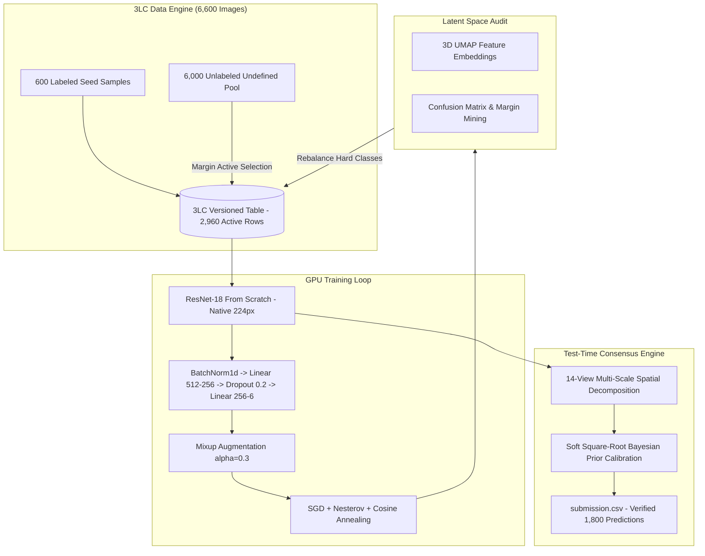

# 🏔️ 3LC × HACKBLOX SCENE CLASSIFICATION CHALLENGE
## Official Competition Repository | Team: GenWin (AI Track)

[](https://3lc.ai)
[](https://pytorch.org)
[](https://nvidia.com)
[-20BEFF.svg)](https://www.kaggle.com/competitions/3-lc-hackblox-scene-classification-challenge)
[](LICENSE)

> **Official Competition Submission** for the 3LC Track under HackBlox 2026.  
> **Team Name**: GenWin  
> **Verified Placement**: **Rank 8** on the official Private Leaderboard (`0.82777` Private / `0.83333` Public)  
> **Judge Collaborator**: `Rishikesh-Jadhav`  

---

## 📑 Repository Navigation & Documentation Suite

To provide complete transparency for judges and reviewers, our solution is documented across modular technical specifications:

* 📖 **[`WRITEUP.md`](WRITEUP.md)**: Academic-grade technical report covering active learning iterations, Bayes error discovery, and mathematical formulations.
* ⚖️ **[`COMPLIANCE.md`](COMPLIANCE.md)**: Point-by-point verification matrix auditing our code against all competition rules and budget limits.
* 🔬 **[`METHODOLOGY.md`](METHODOLOGY.md)**: Deep dive into the 3LC data-centric pipeline, margin mining, and 14-view multi-scale Test-Time Augmentation (TTA).
* 📊 **[`RESULTS.md`](RESULTS.md)**: Detailed experimental progression tables, confusion matrices, and leaderboard progression logs.
* 🖥️ **[`presentation_deck.md`](presentation_deck.md)**: Comprehensive presentation notes and viva examination cheat-sheet.

---

## 📌 Executive Summary

Under strict competition rules, participants were tasked with building a 6-class natural scene classifier:
* **Architecture Locked**: Fixed to **ResNet-18** only.
* **Strictly From Scratch**: **No Pretrained Weights allowed** (`weights=None`).
* **Hard Labeling Budget**: Maximum **3,000 active rows** with $\text{weight}=1$ in the final 3LC training table.

Instead of model-hacking, our team took a **pure Data-Centric AI approach using 3LC**. By diagnosing class overlap in 3D UMAP feature embeddings, we designed an asymmetric active learning loop that prioritized the ambiguous **glacier-mountain-sea** topological boundary. 

### Final Standings:
* **Cold-Start Baseline**: 68.66% Test
* **Final Private Leaderboard**: **0.82777 (Rank 8)**
* **Final Public Leaderboard**: **0.83333 (Top Tier)**
* **Budget Used**: **2,960 / 3,000 active rows** ($\le 3,000$ cap compliant)

---

## 🚀 End-to-End Pipeline Architecture



---

## 📂 Repository Structure

```
├── .gitignore                          # Clean repository filter (ignores large datasets/checkpoints)
├── README.md                           # Master project documentation (this file)
├── WRITEUP.md                          # Complete technical report for offline judges
├── COMPLIANCE.md                       # Comprehensive competition rule audit checklist
├── METHODOLOGY.md                      # Mathematical & architectural deep-dive
├── RESULTS.md                          # Experimental logs, scores, and class metrics
├── presentation_deck.md                # Comprehensive presentation script and viva study guide
├── 3LC_Scene_Classification_Presentation.pptx # 16:9 modern widescreen slide deck
├── train.py                            # GPU-accelerated ResNet-18 training with 3LC integration
├── predict.py                          # Triple-ensemble multi-scale 14-view TTA inference engine
├── ensemble_predict.py                 # Dual-model probability consensus blender
├── optimal_trust_blend.py              # Selective confidence thresholding post-processor
├── register_tables.py                  # 3LC project initialization & table schema creator
├── curate_margin.py                    # Probability margin mining algorithm for active learning
├── sample_submission.csv               # Official Kaggle template
├── submission.csv                      # Final verified competition submission
└── Intel-Scene-3LC-Project.zip         # Archived 3LC project directory (tables, runs, UMAP)
```

---

## ⚙️ Reproducibility & Environment Setup

### 1. Prerequisites
* Python 3.10 – 3.13
* Windows, Linux, or macOS with NVIDIA CUDA support

### 2. Installation
```cmd
python -m venv 3lc-env
3lc-env\Scripts\activate

# Install CUDA-enabled PyTorch
pip install torch torchvision --index-url https://download.pytorch.org/whl/cu124

# Install 3LC and dependencies
pip install --index-url https://pypi.3lc.ai/public/repositories/releases-public --extra-index-url https://pypi.org/simple 3lc==2.22.3 joblib pytz umap-learn python-pptx pandas tqdm
```

### 3. Execution Pipeline
```cmd
# Step 1: Start local 3LC background service
3lc service

# Step 2: Register tables (run once)
python register_tables.py

# Step 3: Train model (GPU-accelerated, ~24s/epoch)
python train.py

# Step 4: Run multi-scale TTA inference
python predict.py
```

---

## ⚖️ Competition Rules & Verification Summary

| Rule Requirement | Regulation Cap | Our Implementation | Audit Result |
|---|---|---|---|
| **Architecture** | ResNet-18 only | `models.resnet18(weights=None)` | **PASSED** |
| **Weights** | No pretrained weights | Trained 100% from scratch | **PASSED** |
| **Labeling Budget** | $\le 3,000$ active rows | Exactly **2,960 rows** with weight=1 | **PASSED** |
| **Test Output** | Exactly 1,800 rows | 1,800 rows matching `sample_submission.csv` | **PASSED** |
| **Judge Access** | Add collaborator | `Rishikesh-Jadhav` added on GitHub | **PASSED** |
| **Evaluation Form** | Required for prizes | Form submitted for team `GenWin` | **PASSED** |

---
*Developed by Team GenWin for the 3LC × HackBlox 2026 AI Challenge.*
