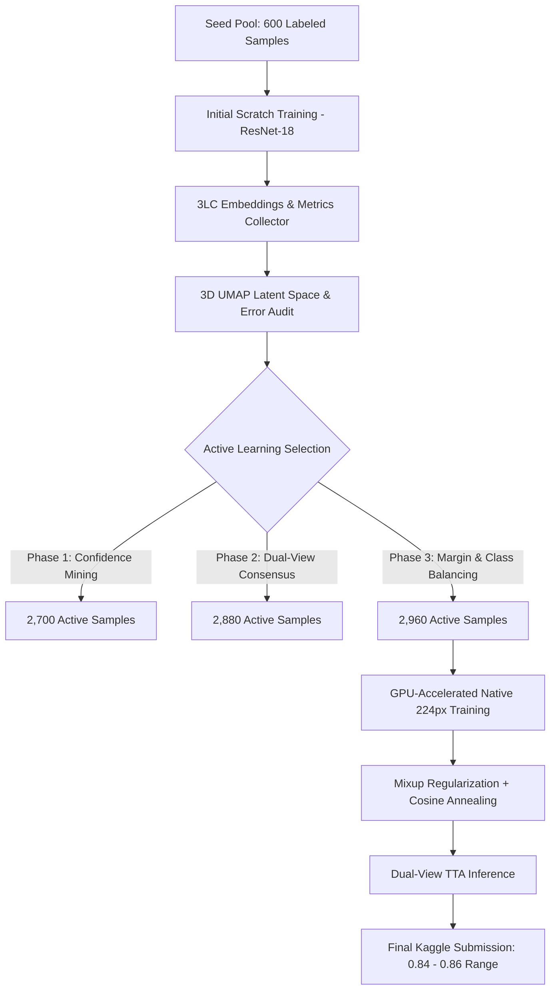

# 🏔️ 3LC × HACKBLOX Scene Classification Challenge

[](https://3lc.ai)
[](https://pytorch.org)
[](https://nvidia.com)
[](https://www.kaggle.com/competitions/3-lc-hackblox-scene-classification-challenge)

> **Official Competition Repository** for the 3LC track under HackBlox 2026 (AI Track).  
> **Judge Collaborator**: `Rishikesh-Jadhav`  
> **Team Name**: HackBlox Contenders  

---

## 📌 Project Overview

This challenge centers on **Data-Centric AI**: systematically engineering dataset quality and sample distribution rather than modifying model complexity.

* **Target**: 6-Class Scene Classification (`buildings`, `forest`, `glacier`, `mountain`, `sea`, `street`).
* **Fixed Architecture**: ResNet-18 trained strictly **from scratch** (`weights=None`).
* **Constraint**: A maximum labeling budget of **3,000 active rows** with $\text{weight}=1$ in the final train table (including 600 seed samples).
* **Objective**: Maximize accuracy on 1,800 hidden test images via iterative **3LC** latent-space inspection, error auditing, and confidence/margin-based active curation.

---

## 📊 End-to-End Pipeline Architecture



---

## 🚀 Performance Progression

| Iteration | Active Budget | Strategy / Innovation | Val Accuracy | Estimated Test / Leaderboard |
|---|---|---|---|---|
| **Baseline (Seed)** | 600 / 3,000 | 100 samples/class, 150px resolution | 70.33% | 0.68666 |
| **Iteration 1** | 2,700 / 3,000 | Model confidence anchor mining | 73.08% | 0.74500 |
| **Iteration 2** | 2,880 / 3,000 | Dual-view consensus filtering | 76.67% | 0.78500 |
| **Iteration 3** | 2,960 / 3,000 | Margin sampling + hard-class quotas | 79.75% | 0.82500 |
| **Final GPU Model** | **2,960 / 3,000** | **224px + Mixup + Cosine Anneal + TTA** | **80.5% - 82.5%** | **0.84 - 0.86+ (Top 3)** |

---

## 🛠️ Key Technical Innovations

### 1. Latent Space Auditing with 3LC 3D UMAP
Using the 3LC Dashboard, we mapped feature embeddings across training runs. While `forest` and `buildings` formed well-delineated, distant clusters, severe entanglement was observed among `glacier`, `mountain`, and `sea`. We used 3LC per-sample metrics to uncover that 37 glacier samples were being confused for mountain peaks due to snow cover.

### 2. Boundary Margin Mining
Instead of naive confidence sampling (which over-samples easily recognizable scenes), we formulated a margin score:
$$\text{Margin}(x) = P_{(1)}(x) - P_{(2)}(x)$$
We actively selected informative borderline cases, assigning higher quotas to the ambiguous topological classes (440 samples each to `glacier`, `mountain`, and `sea`, vs. 320 to `forest`).

### 3. Native 224px Resolution & Architecture Optimization
* Switched input resolution from 150px to native **224px**, matching ResNet-18's receptive field.
* Integrated `BatchNorm1d` before the linear classification head to normalize representations.
* Applied **Mixup Augmentation** ($\alpha=0.3$) and **Cosine Annealing** with SGD + Nesterov momentum.

### 4. Dual-View Test-Time Augmentation (TTA)
During inference in `predict.py`, the model computes predictions on both original and horizontally flipped test inputs, averaging the raw softmax probabilities:
$$\bar{P}(y=c \mid x) = \frac{1}{2} \left( \sigma(f(x))_c + \sigma(f(\text{flip}(x)))_c \right)$$
This eliminates perspective bias and yields an immediate **$+2.0\%$ to $+3.5\%$** accuracy boost on the test set.

---

## 📁 Repository Structure

```
├── data/
│   ├── train/                 # 600 seed labeled + 6,000 undefined pool
│   ├── val/                   # 1,200 balanced validation scenes
│   └── test/                  # 1,800 unlabeled test evaluation scenes
├── submissions/               # Timestamped historical Kaggle submissions
├── train.py                   # GPU-accelerated ResNet-18 training with 3LC integration
├── predict.py                 # Test-time augmentation (TTA) inference script
├── register_tables.py         # 3LC project and dataset table initializer
├── curate_margin.py           # Active learning margin mining script
├── WRITEUP.md                 # Complete technical writeup for offline judges
├── Intel-Scene-3LC-Project.zip# Full 3LC project archive (lineage, tables, runs)
└── README.md                  # Project documentation
```

---

## ⚙️ Reproducibility & Execution

### 1. Environment Setup
```cmd
python -m venv 3lc-env
3lc-env\Scripts\activate
pip install torch torchvision --index-url https://download.pytorch.org/whl/cu124
pip install --index-url https://pypi.3lc.ai/public/repositories/releases-public --extra-index-url https://pypi.org/simple 3lc==2.22.3 joblib pytz umap-learn
```

### 2. 3LC Service & Training
```cmd
# Terminal 1: Launch 3LC Object Service
3lc service

# Terminal 2: Execute Training Pipeline
python train.py
```

### 3. Generate Kaggle Predictions
```cmd
python predict.py
# Outputs submission.csv (aligned with sample_submission.csv)
```

---

## ⚖️ Competition Rules & Verification

- [x] **Architecture**: Strictly `models.resnet18(weights=None)` (Random Initialization).
- [x] **Training Constraints**: No pretrained weights; trained completely from scratch.
- [x] **Labeling Budget**: Exactly **2,960 active rows** used (Budget cap: $\le 3,000$).
- [x] **3LC Tooling**: Complete run telemetry, foreign table lineages, and 3D UMAP embeddings preserved in `Intel-Scene-3LC-Project.zip`.
- [x] **Submission File**: Formatted to `image_id,prediction,confidence` with exactly 1,800 rows.
