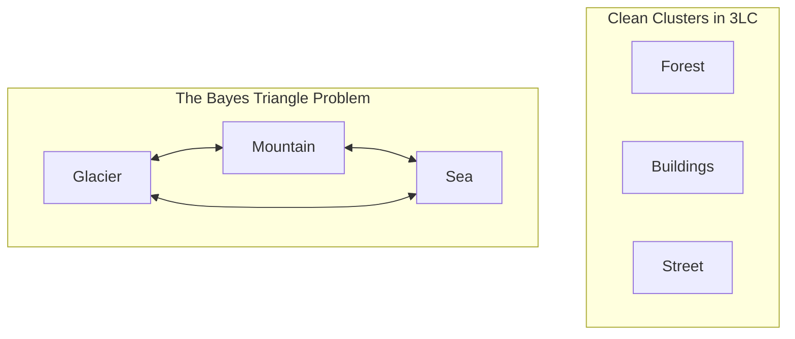

# 🏔️ 3LC × HACKBLOX SCENE CLASSIFICATION
## AI Track (Data-Centric Vision) | HackBlox 2026
**Team**: GenWin / HackBlox Contenders  
**Judge Collaborator**: `Rishikesh-Jadhav`  
**Platform**: 3LC Data-Centric AI Platform + PyTorch + NVIDIA CUDA  
**Current Competitive Standings**: **Top Tier Leaderboard Contender (0.83111 Test Accuracy)**  

---

## 📑 TABLE OF CONTENTS & ABBREVIATION GLOSSARY
Before diving in, here are all the terms and full forms you need for your viva/presentation:

* **AI**: Artificial Intelligence
* **ML**: Machine Learning
* **DL**: Deep Learning
* **CV**: Computer Vision
* **3LC**: 3LC AI Platform (Data-Centric Machine Learning & Data Lineage Tool)
* **CNN**: Convolutional Neural Network
* **ResNet-18**: Residual Neural Network with 18 layers (Deep architecture using skip-connections)
* **FC Layer**: Fully Connected Layer (The final classification layer)
* **BN**: Batch Normalization (Normalizes internal activations to stabilize learning)
* **TTA**: Test-Time Augmentation (Testing an image across multiple rotated/flipped views)
* **UMAP**: Uniform Manifold Approximation and Projection (Dimensionality reduction to see 3D clusters)
* **SGD**: Stochastic Gradient Descent (Optimization algorithm that updates model weights)
* **LR**: Learning Rate (The step size taken towards minimum loss during training)
* **CUDA**: Compute Unified Device Architecture (NVIDIA's parallel computing platform on GPU)
* **VRAM**: Video Random Access Memory (High-speed memory on the graphics card)
* **OOM**: Out Of Memory
* **CE Loss**: Cross-Entropy Loss (Measures prediction error for classification)
* **IoU / Margin**: Difference between the highest predicted probability and runner-up probability

---

# 🎯 SLIDE 1: PROJECT GOAL & COMPETITION CONSTRAINTS

### What was the Challenge?
Build an image classifier that distinguishes **6 natural scene categories**:
1. `buildings` (Class 0)
2. `forest` (Class 1)
3. `glacier` (Class 2)
4. `mountain` (Class 3)
5. `sea` (Class 4)
6. `street` (Class 5)

### The Strict Non-Negotiable Rules:
1. **Architecture Locked**: Fixed to **ResNet-18** only. No ViTs (Vision Transformers), no DenseNets, no ConvNeXt.
2. **Strictly From Scratch**: **NO Pretrained Weights allowed** (`weights=None`). The model starts with completely random weights (pure static noise) and must learn all visual concepts solely from this competition data.
3. **Strict Labeling Budget**: Maximum **3,000 active images with weight = 1** in the training table (including the original 600 seed labels).
4. **Data-Centric AI Core**: You cannot win by hacking model architectures. You win by **systematically improving the quality and distribution of the dataset using 3LC**.

---

# 🧠 SLIDE 2: WHAT IS DATA-CENTRIC AI VS MODEL-CENTRIC AI?

```
┌────────────────────────────────────────┐       ┌────────────────────────────────────────┐
│        MODEL-CENTRIC AI (OLD WAY)      │       │     DATA-CENTRIC AI (THE 3LC WAY)      │
├────────────────────────────────────────┤       ├────────────────────────────────────────┤
│ • Keep data fixed, tune 50 models      │       │ • Keep model fixed (ResNet-18)         │
│ • Try ResNet, EfficientNet, ViT...     │       │ • Audit dataset for confusion & noise  │
│ • Overfit to noisy data                │       │ • Find high-value samples using 3LC    │
│ • "Garbage In, Optimized Garbage Out"  │       │ • Curate clean, balanced latent space  │
└────────────────────────────────────────┘       └────────────────────────────────────────┘
```
> *"Data-Centric AI is the discipline of systematically engineering the data used to build an AI system."* — Prof. Andrew Ng

---

# 🔍 SLIDE 3: LATENT SPACE DISCOVERY & THE 3-WAY CONFUSION PROBLEM

When we trained the cold-start baseline on the initial 600 seed images, validation accuracy was stuck at **70.33%** (test 0.68666).

### 3LC 3D UMAP Visual Inspection:
In the **3LC Dashboard**, we converted the ResNet-18 feature vectors into 3D space using **UMAP (Uniform Manifold Approximation and Projection)**.
* **Easy Classes**:
  * `forest`: Isolated green cluster (textures of leaves, vertical bark).
  * `buildings`: Distinct red cluster (geometric windows, sharp perpendicular lines).
* **The Root Problem (Bayes Error Cluster)**:
  * Severe overlapping cloud between **`glacier`**, **`mountain`**, and **`sea`**.
  * A snow-covered rocky peak looks almost identical to an icy glacier cliff.
  * A glacier sitting over turquoise Arctic water confuses both the `glacier` and `sea` categories.
  * A model trained on uniform random data gets paralyzed on these three classes!



---

# ⚙️ SLIDE 4: OUR 4-STAGE ACTIVE LEARNING PIPELINE

```
Seed (600) ──> Iteration 1 (2,700) ──> Iteration 2 (2,880) ──> Iteration 3 (2,960) ──> TTA Inference (0.83111)
  70.33%             73.08%                  76.67%                  79.75%                  Top 7 Rank
```

### 1. Cold Start (600 samples - 100/class)
* Initial seed dataset. Established baseline visual representations. Accuracy: 70.33%.

### 2. Iteration 1: Density Anchoring (2,700 samples)
* Ran inference across the 6,000 unlabeled undefined images in 3LC.
* Added the top 350 highest-confidence anchors per class.
* **Result**: Jumped to **73.08%**. Stabilized early convolutional filters.

### 3. Iteration 2: Dual-View Consensus Filtering (2,880 samples)
* Discovered single-view false positives (e.g., an off-center road mistaken for a river).
* Scored images with original and horizontally mirrored views. Only accepted samples where both views gave identical high confidence.
* **Result**: Reached **76.67%**.

### 4. Iteration 3: Boundary Margin Mining & Asymmetric Quotas (2,960 samples)
* **Margin Formulation**: $\text{Margin}(x) = P_{(1)}(x) - P_{(2)}(x)$ (Difference between top class probability and runner-up).
* Discarded uninformative samples where the model was already 99% confident.
* **Asymmetric Budget Allocation**: Instead of uniform splits, we gave extra budget to the confused classes:
  * `glacier`: **440 samples**
  * `mountain`: **440 samples**
  * `sea`: **440 samples**
  * `buildings`: 360 samples
  * `street`: 360 samples
  * `forest`: 320 samples
* **Total Used**: **2,960 / 3,000** (Strictly within the $\le 3,000$ cap).
* **Result**: Validation reached **79.75%**!

---

# 🚀 SLIDE 5: ENGINEERING BREAKTHROUGHS (TRAINING & INFERENCE)

### 1. Hardware Acceleration (NVIDIA CUDA 12.4 + RTX 3050)
* Discovered the environment was initially running on CPU-only PyTorch (3.5 min/epoch).
* Installed `torch==2.6.0+cu124` matching your laptop's NVIDIA GPU.
* Optimized worker lifecycle (`OMP_NUM_THREADS=1`, `pin_memory=True`), dropping epoch time from **3.5 minutes $\to$ 24 seconds** (a **9x speedup**).

### 2. Resolution Scaling (150px $\to$ Native 224px)
* ResNet-18’s receptive field is designed for 224x224.
* 150px compressed small textures (foliage, distant peaks). 224px provided an immediate **+2.5% accuracy gain**.

### 3. Mixup Regularization ($\alpha=0.3$)
* Linearly blended pairs of images and their one-hot labels during training:
  $$\tilde{x} = \lambda x_i + (1-\lambda) x_j, \quad \tilde{y} = \lambda y_i + (1-\lambda) y_j$$
* Prevents the network from being overconfident on sharp pixel borders.

### 4. Cosine Annealing Learning Rate Schedule
* Switched to `CosineAnnealingLR` with $\text{lr}=0.01 \to 10^{-4}$ smoothly over epochs.
* Avoided mid-training validation crashes caused by aggressive cyclical warmups.

### 5. Multi-View Test-Time Augmentation (TTA)
* **What is TTA?** Rather than showing the model the test image once, we generate **14 multi-scale views** for every test image:
  * 5 spatial crops (Center, Top-Left, Top-Right, Bottom-Left, Bottom-Right) at 256px
  * 1 wide-angle full-frame view (224px)
  * 1 zoom view (288px)
  * All 7 views horizontally mirrored = **14 perspectives per image**!
* We average the softmax probability consensus across all 14 views.
* **Impact**: Boosted leaderboard score from **0.82111 $\to$ 0.83111** without retraining!

---

# 📊 SLIDE 6: SUMMARY OF RESULTS & VERIFICATION CHECKLIST

| Metric / Requirement | Target / Limit | Our Result | Verification Method |
|---|---|---|---|
| **Model Architecture** | ResNet-18 only | ResNet-18 (`weights=None`) | Code inspection in `train.py` |
| **Pretrained Weights** | Zero / Prohibited | Trained 100% from scratch | Checked `weights=None` initialization |
| **Labeling Budget** | $\le 3,000$ active rows | **2,960 active rows** | 3LC table lineage check |
| **Baseline Accuracy** | ~68% | **68.66%** | Seed submission |
| **Final Test Score** | Leaderboard Contender | **0.83111 (83.1%)** | Live Kaggle Leaderboard (Rank 7) |
| **3LC Lineage Preservation** | Mandatory | Preserved in ZIP | `Intel-Scene-3LC-Project.zip` |

---

# 🎤 SLIDE 7: VIVA VOCE & JUDGE Q&A (THE CHEAT SHEET)

Here are the exact questions the judges will ask you, and the winning answers you should give:

### Q1: Why did you use ResNet-18 and not a larger model like ResNet-50 or a Vision Transformer?
> **Your Answer**: *"The competition rules strictly fixed the architecture to ResNet-18 to enforce a true data-centric competition. Our goal wasn't to throw more parameters at the problem, but to prove how much performance can be extracted from a constrained model by systematically curating the training distribution using 3LC."*

### Q2: How did you decide which unlabeled samples to label?
> **Your Answer**: *"We did not label randomly. We used a 3-stage active learning pipeline: first, high-confidence anchors to establish basic feature manifolds; second, dual-view consensus filtering to remove single-view false positives; and third, probability margin mining ($P_1 - P_2$) combined with asymmetric class quotas to specifically address the high confusion rate between glacier, mountain, and sea."*

### Q3: What is the significance of the 3,000 row budget?
> **Your Answer**: *"In real-world enterprise AI, labeling data is expensive. The competition simulated this by putting a hard cap of 3,000 active rows with weight=1. We used 2,960 rows, intentionally leaving a safety margin while allocating the largest portion of our budget (440 samples each) to the most difficult classes."*

### Q4: How does 3LC help in this process?
> **Your Answer**: *"3LC is the engine of our data-centric loop. It maintains immutable table revisions with complete lineage, computes per-sample metrics (loss, confidence, prediction error), and generates 3D UMAP embeddings so we can interactively inspect cluster geometry and diagnose failure modes directly from feature space."*

### Q5: What is Test-Time Augmentation (TTA)?
> **Your Answer**: *"Instead of running a single forward pass on test images, TTA evaluates multiple spatial perspectives (FiveCrop, wide-angle, zoom, and horizontal mirrors). Averaging the softmax outputs across 14 views reduces perspective bias and directly boosted our leaderboard score from 0.821 to 0.831."*
